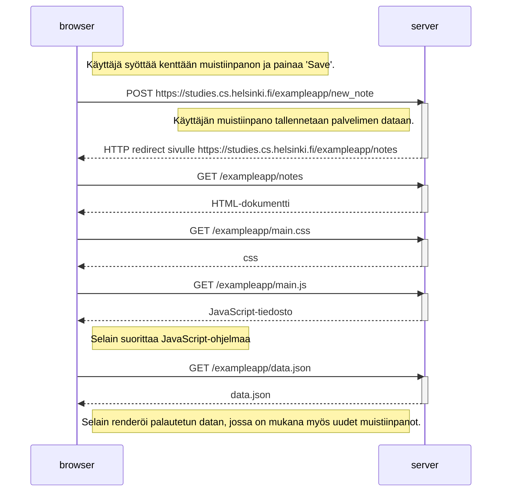

# Full Stack Open – Part 0

## 0.4 New note diagram

```mermaid
sequenceDiagram
    participant browser
    participant server
    

    Note right of browser: Käyttäjä syöttää kenttään muistiinpanon ja painaa 'Save'.
    browser->>server: POST https://studies.cs.helsinki.fi/exampleapp/new_note
    activate server
    Note left of server: Käyttäjän muistiinpano tallennetaan palvelimen dataan.
    server-->>browser: HTTP redirect sivulle https://studies.cs.helsinki.fi/exampleapp/notes
    deactivate server
    
    browser->>server: GET /exampleapp/notes
    activate server
    server-->>browser: HTML-dokumentti
    deactivate server
    
    browser->>server: GET /exampleapp/main.css  
    activate server
    server-->>browser: css 
    deactivate server

    browser->>server: GET /exampleapp/main.js  
    activate server
    server-->>browser: JavaScript-tiedosto 
    deactivate server
    
    Note right of browser: Selain suorittaa JavaScript-ohjelmaa

    browser->>server: GET /exampleapp/data.json
    activate server
    server-->>browser: data.json
    deactivate server    

    Note right of browser: Selain renderöi palautetun datan, jossa on mukana myös uudet muistiinpanot.
```