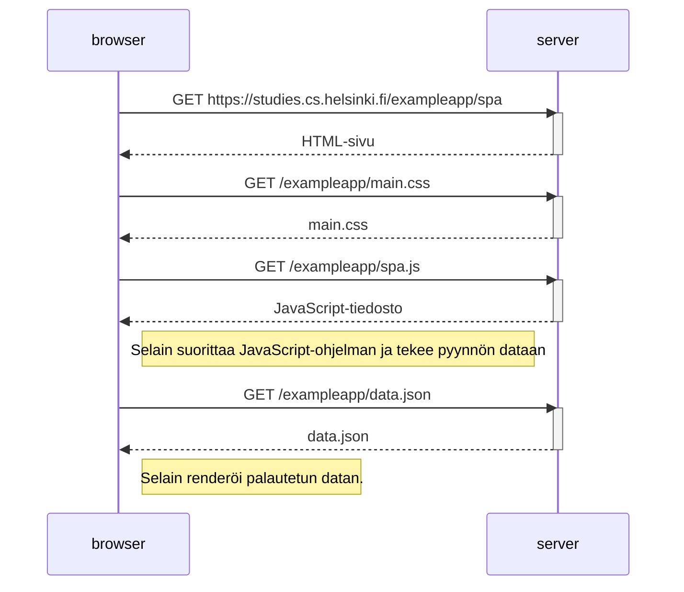

# Full Stack Open – Part 0

## 0.5 Single page app 

```mermaid
sequenceDiagram
    participant browser
    participant server
    
    browser->>server: GET https://studies.cs.helsinki.fi/exampleapp/spa
    activate server
    server-->>browser: HTML-sivu
    deactivate server
    
    browser->>server: GET /exampleapp/main.css
    activate server
    server-->>browser: main.css
    deactivate server

    browser->>server: GET /exampleapp/spa.js  
    activate server
    server-->>browser: JavaScript-tiedosto 
    deactivate server
    
    Note right of browser: Selain suorittaa JavaScript-ohjelman ja tekee pyynnön dataan

    browser->>server: GET /exampleapp/data.json
    activate server
    server-->>browser: data.json
    deactivate server    

    Note right of browser: Selain renderöi palautetun datan.
```