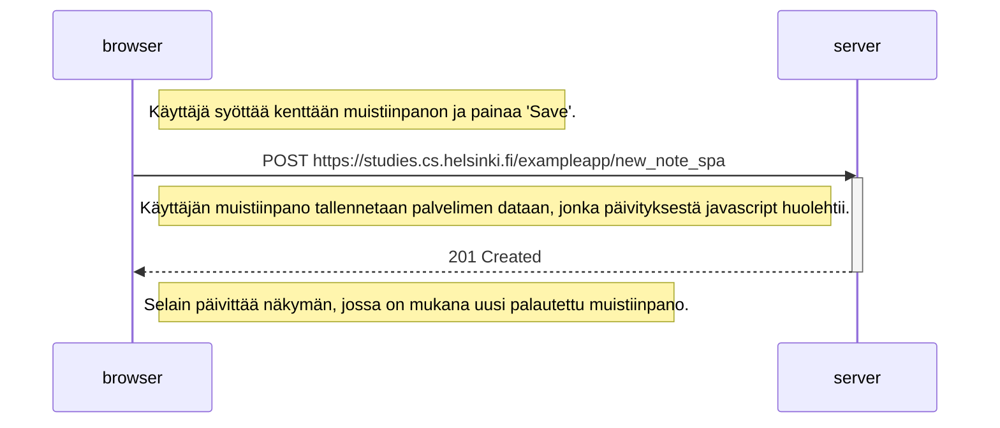

# Full Stack Open – Part 0

## 0.6 New note diagram SPA

```mermaid
sequenceDiagram
    participant browser
    participant server
    

    Note right of browser: Käyttäjä syöttää kenttään muistiinpanon ja painaa 'Save'.
    browser->>server: POST https://studies.cs.helsinki.fi/exampleapp/new_note_spa
    activate server
    Note left of server: Käyttäjän muistiinpano tallennetaan palvelimen dataan, jonka päivityksestä javascript huolehtii.
    server-->>browser: 201 Created
    deactivate server
 

    Note right of browser: Selain päivittää näkymän, jossa on mukana uusi palautettu muistiinpano.

```